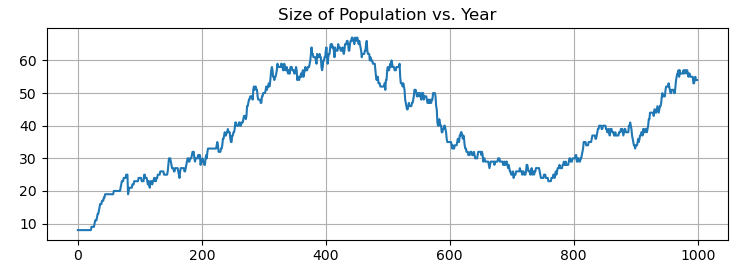
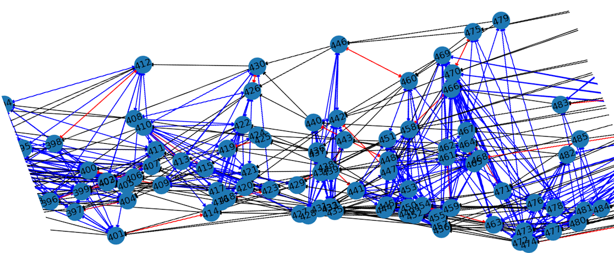

# Family Tree Simulation
A moderately simple piece of code to model a trivially simplified family tree in a closed population.  

This was created for the purpose of testing some of the neural inductive logic programming solvers from our research group.  In such analysis, it is important to be able to inject "noise" on the relational graph, and to examine the effect of average sample size to learning quality statistics.  I created this, in part, based on William Cohen's analysis of Tensorlog (https://arxiv.org/pdf/1605.06523.pdf).  

I appreciate the simple graph evaluations Cohen uses, as they convey an intutive sense sense of the capability of the method. However, I feel there is a gap between the simple graphs he introduced and the more standard graph datasets researchers typically use in graph neural network and probabalistic logic programming evaluations. This simulation allows for some intuitive tunability of parameters like branching factor and width vs. depth, and can be extended to temporal and causal analysis by assigning "people" in the graph additional attributes.  Such attributes might include simple properties, like probabalistic age at death, or more sophisticated relationships, such as mentorship and skill transferance. 

# Simulation Overview
The family tree simulation is implemented in the **Person** class in **family_tree.py**. Each Person object represents an individual in the simulated population and has attributes such as **name**, **gender**, **birth** and **death** year, **parents**, **spouse**, **children**, **siblings**, **grandparents**, **aunts/uncles**, and **nieces/nephews**.

The Person class includes methods for creating and modifying family relationships, such as **marry()**, **add_child()**, **add_sibling()**, **add_cousin()**, **add_uncle()**, **add_aunt()**, **add_nephew()**, **add_niece()**, and **age()**.

The simulation begins with an initial population of eight (8) individuals with two married couples, and iterates over a fixed number of time steps, during which individuals may be born, marry, and die according to specified probabilities.

The parameters are chosen so that any population will evenutally die out, and then a long-lived population is chosen by monte-carlo sampling.
The graph of population vs. time for the random seed used in the example is show below:
# Plotting and Data Examples
Example JSON samples from this population look like this:
```json

{"name": 424, "gender": "female", "birth_year": 863, "death_year": 944, "spouse": 422, "father": 415, "mother": 410, "grandfather": 404, "grandmother": 397, "children": [437, 443], "cousins": [419, 425]}

{"name": 425, "gender": "male", "birth_year": 864, "death_year": 945, "spouse": 419, "father": 413, "mother": 408, "grandfather": 404, "grandmother": 397, "children": [436, 438], "cousins": [424]}

```
Here is a plot of a sample population over time:


The full relational graph is somewhat large, but here's one section out of the full graph. 
The edge color key is as follows: Red = spouse, Black = parent, Blue = cousin.



The family tree for some of the main Harry Potter characters, as reported by ChatGPT.

